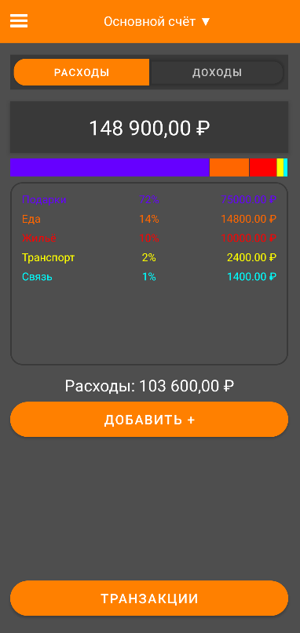
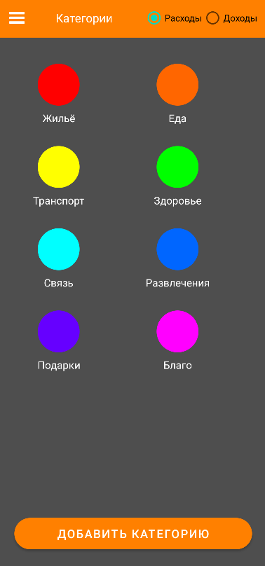

# 💸 MoneyDealer

**MoneyDealer** — это современное Android-приложение для учёта личных финансов, расходов и доходов.
Управляйте счетами, отслеживайте регулярные платежи, анализируйте траты и достигайте финансовых целей!

## 📲 Скриншоты

<p align="center">
  
  
  
  
  
  
</p>

## 🚀 Возможности

- ✨ Удобный учёт доходов и расходов
- 💳 Мультивалютные счета
- 🔄 Регулярные платежи
- 🔒 Безопасность данных (Firebase Auth)
- ☁️ Синхронизация с облаком (Firebase)
- 🎨 Современный и интуитивный интерфейс

## 🛠️ Установка

1. **Склонируйте репозиторий:**
   ```bash
   git clone https://github.com/yourusername/MoneyDealer.git
   ```
2. **Откройте проект в Android Studio.**
3. **Добавьте файл `google-services.json`** (если используете Firebase).
4. **Соберите и запустите приложение:**
   - Через Android Studio: `Run → Run 'app'`
   - Или соберите APK:
     ```bash
     ./gradlew assembleDebug
     ```

## 📦 Сборка APK

- **Debug APK:**  
  `app/build/outputs/apk/debug/app-debug.apk`
- **Release APK:**  
  `app/build/outputs/apk/release/app-release.apk`

## 🧑‍💻 Технологии

- **Java**
- **Android SDK**
- **Firebase (Auth, Realtime Database)**
- **Material Design**

## 📬 Контакты

- Telegram: [@Elonum](https://t.me/elonum)
- Email: romanivanov.main@gmail.com

> _MoneyDealer — ваш личный помощник в мире финансов!_
